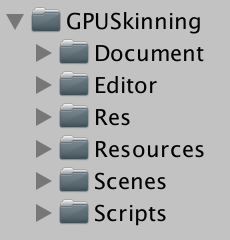
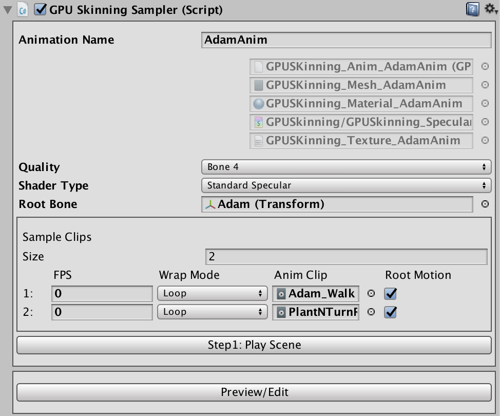
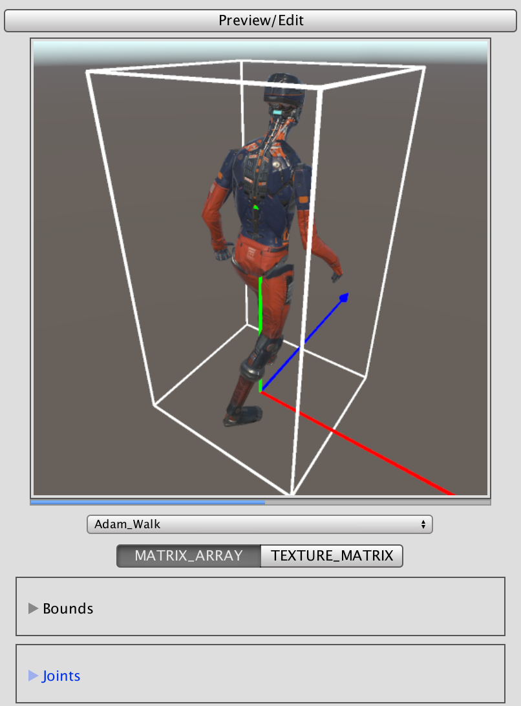
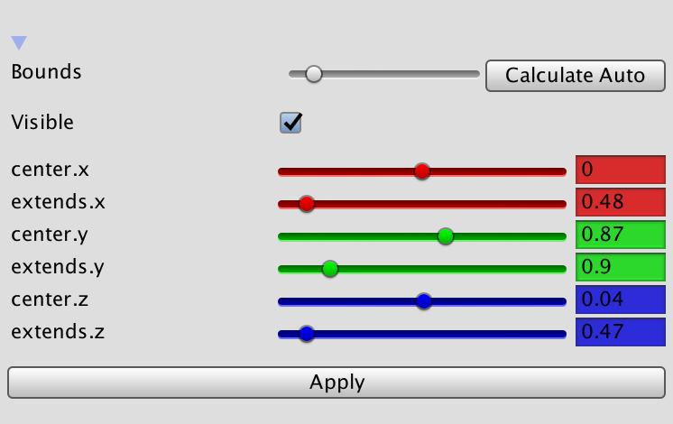
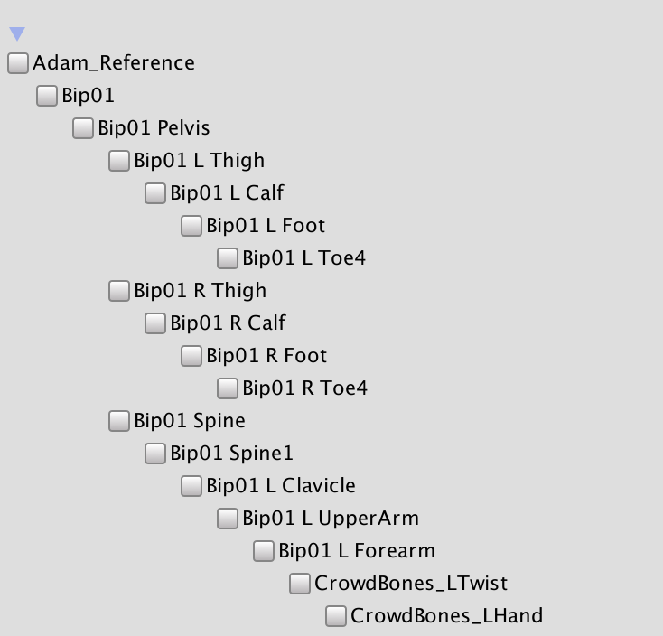
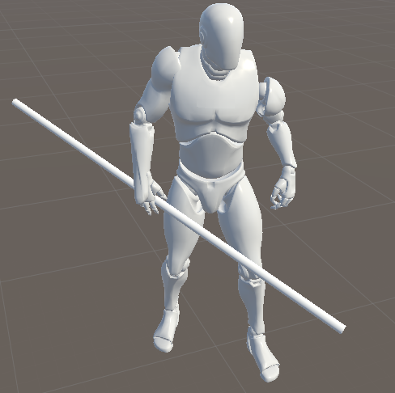

# GPUSkinning V0.2.1 User Guide

## Brief

Using this tool you can bake skeleton animation into Texture2D and skinning in GPU. This can reduce overhead of CPU-Skinning.

Many types of animation can be sampled by this tool including Legacy, Generic, Humanoid.

GPU Instancing will be turned on if it is supported by hardware to reduce drawcall as much as possible.

## Folders

> 

* Document
* Editor : Editor Scripts of This Tool
* Res : Resouces of Demo Scenes
* Resources : Necessary Resources of This Tool
* Scenes : Demo Scenes
* Script : Runtime Scripts of This Tool

## Introducing Editor UI

Open a demo scene (Assets/GPUSkinning/Scenes/Adam_Sampler/Adam_Sampler.unity).

Select a gameobject named Adam in the hierarchy window.

The Editor will be shown in the Inspector window.

> 

Animation Name : A name given here will be used as file name when saving sampling data.

Five gray slots are used to display sampling data.

Quality : Quality of skeleton animation.

Shader Type : How to shading model.

New Shader : Compile Unity built-in PBR shader will cause a long time hiccup. So you can toggle it off to avoid this.

Root Bone : The transform of root bone.

Sample Clips : All animation clips you want to sample.

Size : The number of animation clips.

FPS : Sampling rate. The default value 0 means using the fps of animation clip.

Wrap Mode : Loop or Once.

Root Motion : Whether apply root motion when sampling.

**Note : Before sampling，make sure the Loop Time of Animation Clip is toggled on, otherwise the sampling may be failed.**

## Sampling

Click Step1 : PlayScene.

Click Step2 : Start Sample.

Saving window will popup if it is the first time to sample.

## Preview & Edit

Click Preview/Edit.

> 

You can preview animation by select a clip name in the drop-down menu.

The RGB arrows is the model's local axes.

The white wire box is the bounds of mesh. You should set the bounds correctly, otherwise it will cause a incorrect view frustum culling.

## Edit Bounds

> 

Click Calculate Auto to calculate bounds automatically, then edit the detail by dragging corresponding slider.

## Apply Root Motion

Click Apply Root Motion.

## Edit Joints

> 

There is not any joint by default. The toggled-on joints will be visible. e.g. You can attach a weapon to a joint.

## Play

* Open scene（Assets/GPUSkinning/Scenes/Adam_Sampler/Adam_Player.unity）
* Create a GameObject.
* Attach GPUSkinningPlayerMono script to the gameobject.
* Drag sampling data into the slots of GPUSkinningPlayerMono.
* Select the gameobject to preview animation.
* Attach a weapon to the joint.
* Play.

> 

## Tips

* Each joint will be recognized by a guid. The guid is generated by joint's hierarchy path(hierarchy path is a joint's route path starting from the root joint like file path of os). So maybe two joints' guid will be the same, this is not expected. You can avoid this by giving joint a meaningful name.
