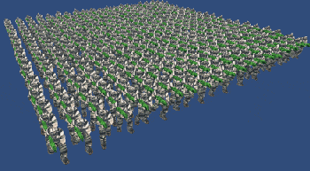

## GPUSkinning to improve performance.

Record data of bone animation from Animation Component, customize GPUSkinning rather than Unity built-in.

4 Ways to implement: 

1. Compute bone hierarchy matrix of current frame in Application code -> push **Matrix Array** to GPU -> Skinning in Vertex Shader -> Next Frame(Goto first step)

2. Compute bone hierarchy matrix of all frames -> Store all matrices into a **Texture2D** -> Skinning in Vertex Shader(Extract all matrices of current frame to skinning)(Using **"additionalVertexStreams"** to get individual animtion)

3. Base on Way1 and Way2, Using **GPU Instancing** to get the minimum Batches, Using **CullingGroup** to implement **Level of Detail** to reduce triangle-rendering overhead.

4. Compute bone hierarchy matrix of all frames -> Store data into a **ComputeBuffer** -> Skinning in ComputeShader(DirectX 11)

> 
>
> screenshot

> 
>
> Adding a new feature that we can attach weapon to hand joint in this example.

[http://chengkehan.github.io/GPUSkinning.html](http://chengkehan.github.io/GPUSkinning.html)

[http://chengkehan.github.io/GPUSkinning2.html](http://chengkehan.github.io/GPUSkinning2.html)

[http://chengkehan.github.io/GPUSkinning3.html](http://chengkehan.github.io/GPUSkinning3.html)
